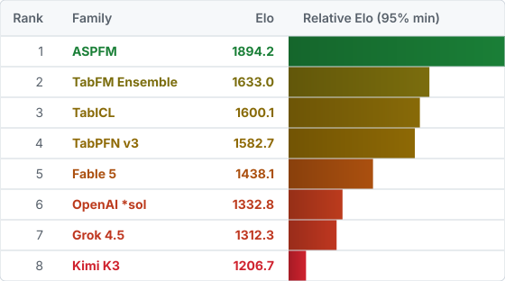
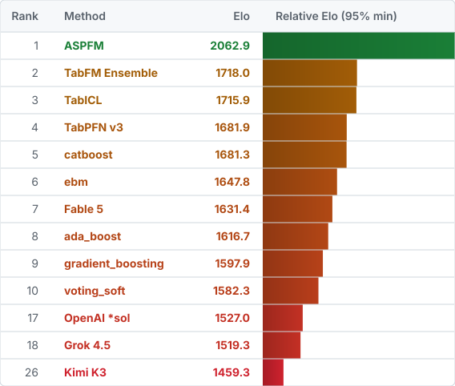
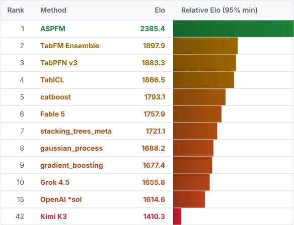
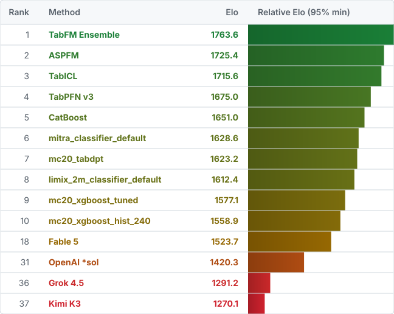
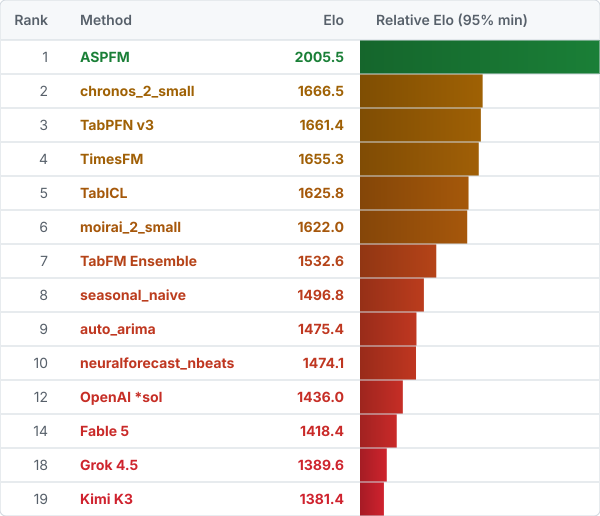

# SOTArena

SOTArena is a JSON-backed benchmark with deterministic Elo rankings. Every manifest and result is loaded and validated. Elo uses each task's analysis cohort: the datasets with a valid canonical score from every automatically Global-eligible family. The referenced blacklists record the auditable complement without removing corpus data.

## Getting Started

Clone and build the reporter:

```sh
git clone https://github.com/neverhuman/sotarena.git
cd sotarena
cargo build --release
```

Download one dataset, a whole task, or every downloadable dataset:

```sh
cargo run --release -- fetch --task binary --dataset ad2b3ffae29d73f6
cargo run --release -- fetch --task binary
cargo run --release -- fetch --all
```

Downloads default to `$HOME/.cache/sotarena/benchmark`. To use another directory outside the repository, pass `--cache-dir /path/to/cache` or set `SOTARENA_BENCHMARK_CACHE`.

Generate the JSON report, leaderboard SVGs, and refresh this README:

```sh
cargo run --release -- report --out report.json
```

## Global Elo

Datasets: 2677. Download all: `cargo run --release -- fetch --all`.

<picture>
  <source media="(prefers-color-scheme: dark)" srcset="assets/leaderboards/global-dark.svg">
  <source media="(prefers-color-scheme: light)" srcset="assets/leaderboards/global-light.svg">
  
</picture>

<details>
<summary>Markdown fallback</summary>

| Rank | Family | Elo |
| ---: | --- | ---: |
| 1 | **ASPFM** | **1904.2** |
| 2 | **TabFM Ensemble** | **1590.6** |
| 3 | **TabICL** | **1583.8** |
| 4 | **TabPFN v3** | **1571.2** |
| 5 | **Fable 5** | **1429.5** |
| 6 | **OpenAI \*sol** | **1351.0** |
| 7 | **Grok 4.5** | **1318.6** |
| 8 | **Kimi K3** | **1251.0** |

</details>

## Binary Elo

Datasets: 799. Download all: `cargo run --release -- fetch --task binary`.

<picture>
  <source media="(prefers-color-scheme: dark)" srcset="assets/leaderboards/binary-dark.svg">
  <source media="(prefers-color-scheme: light)" srcset="assets/leaderboards/binary-light.svg">
  
</picture>

<details>
<summary>Markdown fallback</summary>

| Rank | Method | Elo |
| ---: | --- | ---: |
| 1 | **ASPFM** | **2062.9** |
| 2 | **TabFM Ensemble** | **1718.0** |
| 3 | **TabICL** | **1715.9** |
| 4 | **TabPFN v3** | **1681.9** |
| 5 | **catboost** | **1681.3** |
| 6 | **ebm** | **1647.8** |
| 7 | **Fable 5** | **1631.4** |
| 8 | **ada\_boost** | **1616.7** |
| 9 | **gradient\_boosting** | **1597.9** |
| 10 | **voting\_soft** | **1582.3** |
| 17 | **OpenAI \*sol** | **1527.0** |
| 18 | **Grok 4.5** | **1519.3** |
| 26 | **Kimi K3** | **1459.3** |

</details>

## Regression Elo

Datasets: 1564. Download all: `cargo run --release -- fetch --task regression`.

<picture>
  <source media="(prefers-color-scheme: dark)" srcset="assets/leaderboards/regression-dark.svg">
  <source media="(prefers-color-scheme: light)" srcset="assets/leaderboards/regression-light.svg">
  
</picture>

<details>
<summary>Markdown fallback</summary>

| Rank | Method | Elo |
| ---: | --- | ---: |
| 1 | **ASPFM** | **2385.4** |
| 2 | **TabFM Ensemble** | **1897.9** |
| 3 | **TabPFN v3** | **1883.3** |
| 4 | **TabICL** | **1866.5** |
| 5 | **catboost** | **1793.1** |
| 6 | **Fable 5** | **1757.9** |
| 7 | **stacking\_trees\_meta** | **1721.1** |
| 8 | **gaussian\_process** | **1688.2** |
| 9 | **gradient\_boosting** | **1677.4** |
| 10 | **Grok 4.5** | **1655.8** |
| 15 | **OpenAI \*sol** | **1614.6** |
| 42 | **Kimi K3** | **1410.3** |

</details>

## Multiclass Elo

Datasets: 272. Download all: `cargo run --release -- fetch --task multiclass`.

<picture>
  <source media="(prefers-color-scheme: dark)" srcset="assets/leaderboards/multiclass-dark.svg">
  <source media="(prefers-color-scheme: light)" srcset="assets/leaderboards/multiclass-light.svg">
  
</picture>

<details>
<summary>Markdown fallback</summary>

| Rank | Method | Elo |
| ---: | --- | ---: |
| 1 | **ASPFM** | **1753.0** |
| 2 | **TabFM Ensemble** | **1713.7** |
| 3 | **TabICL** | **1686.1** |
| 4 | **TabPFN v3** | **1642.6** |
| 5 | **CatBoost** | **1635.8** |
| 6 | **mc20\_tabdpt** | **1602.4** |
| 7 | **mitra\_classifier\_default** | **1601.0** |
| 8 | **limix\_2m\_classifier\_default** | **1598.9** |
| 9 | **mc20\_xgboost\_tuned** | **1572.2** |
| 10 | **mc20\_xgboost\_hist\_240** | **1560.3** |
| 20 | **Fable 5** | **1515.3** |
| 31 | **OpenAI \*sol** | **1430.5** |
| 36 | **Kimi K3** | **1333.7** |
| 37 | **Grok 4.5** | **1324.7** |

</details>

## Timeseries Elo

Datasets: 42. Download all: `cargo run --release -- fetch --task timeseries`.

<picture>
  <source media="(prefers-color-scheme: dark)" srcset="assets/leaderboards/timeseries-dark.svg">
  <source media="(prefers-color-scheme: light)" srcset="assets/leaderboards/timeseries-light.svg">
  
</picture>

<details>
<summary>Markdown fallback</summary>

| Rank | Method | Elo |
| ---: | --- | ---: |
| 1 | **ASPFM** | **2005.5** |
| 2 | **chronos\_2\_small** | **1666.5** |
| 3 | **TabPFN v3** | **1661.4** |
| 4 | **TimesFM** | **1655.3** |
| 5 | **TabICL** | **1625.8** |
| 6 | **moirai\_2\_small** | **1622.0** |
| 7 | **TabFM Ensemble** | **1532.6** |
| 8 | **seasonal\_naive** | **1496.8** |
| 9 | **auto\_arima** | **1475.4** |
| 10 | **neuralforecast\_nbeats** | **1474.1** |
| 12 | **OpenAI \*sol** | **1436.0** |
| 14 | **Fable 5** | **1418.4** |
| 18 | **Grok 4.5** | **1389.6** |
| 19 | **Kimi K3** | **1381.4** |

</details>
